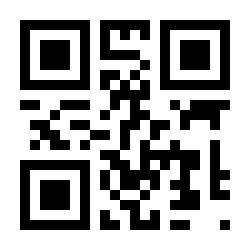

# qr-server

[](https://snapcraft.io/qr-server)

A simple server to generate QR codes, built using Flask and `qrencode`.

## Installation

The [`qr-server` snap](https://snapcraft.io/qr-server) contains the `qr-server` application and all the dependencies required for it to run.

[](https://snapcraft.io/qr-server)

## Usage

Once the snap is installed, it will listen on port 5000, though this can be configured
```
sudo snap set qr-server port=<port>
```
where `<port>` is any available port number.

Requests to the API will return a png of a QR code encoding the data from either the request body or the path following the `/` in the URL.
If the path following the hostname is non-empty, that will be used as the data to encode, and the request body will be ignored.

For example, from the same machine on which `qr-server` is installed, opening http://localhost:5000/hello-world in a browser should display the following:



Equivalently, `curl` can be used to encode data from either the path or the request body:
- `curl http://localhost:5000/hello-world`
- `curl --data-binary 'hello-world' http://localhost:5000`

Both `GET` and `POST` requests are accepted and may be used interchangeably.


## Manual Installation

It is recommended to install the [`qr-server` snap](https://snapcraft.io/qr-server).
However, if you prefer to manually install and manage the service yourself, ensure that the following are installed on your system:

- `python3`
- `flask`
- `qrencode`

Then, clone this repo, and from the project root, run:
```
python3 bin/qr_server.py localhost 5000
```

The hostname and port can be customized as desired.
